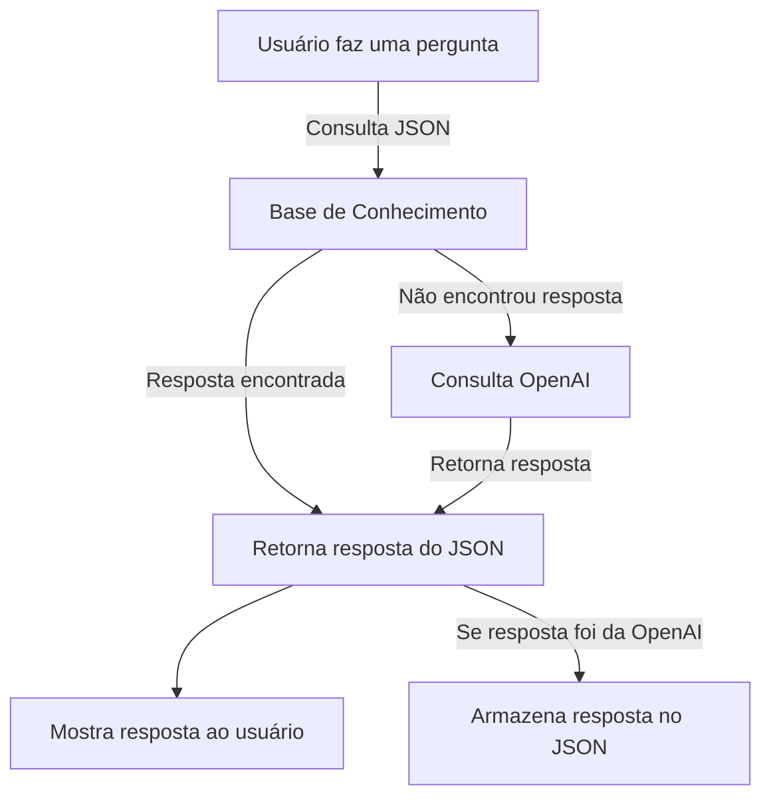

# 🤖 Chatbot A.C.E. Consultoria

## 📌 Visão Geral
Este projeto é um **chatbot híbrido** que combina respostas de uma **base de conhecimento** com respostas geradas por **Inteligência Artificial (OpenAI GPT-4o)**. O chatbot pode ser utilizado tanto via **terminal (CLI)** quanto por meio de uma **API FastAPI**, permitindo integração com diferentes sistemas.

### ✨ **Principais Características:**
✔ **Busca respostas no JSON** antes de acionar a IA.  
✔ **Interação via API e terminal** para maior flexibilidade.  
✔ **Aprendizado contínuo**: Se a resposta vier da OpenAI, o chatbot pode armazená-la para futuras consultas.  
✔ **Registro de logs** para análise de interações e erros.  
✔ **Testes automatizados** para garantir a qualidade das respostas.  

---

## 🎯 **Funcionalidades do Projeto**
✔ **Consulta inteligente**: Se a pergunta já estiver no banco de conhecimento, o chatbot responde imediatamente.  
✔ **Integração com OpenAI**: Se a pergunta não estiver cadastrada, o chatbot consulta a IA da OpenAI.  
✔ **Armazena novas perguntas**: Quando uma resposta vem da OpenAI, ela pode ser salva no JSON para consultas futuras.  
✔ **Interface dupla**: Permite interação via terminal e via API HTTP.  
✔ **Registro de interações e logs** para análise futura.  
✔ **Testes unitários** para garantir que tudo funciona corretamente.  

---

## 🛠️ **Tecnologias Utilizadas**

| Tecnologia | Descrição |
|------------|--------------------------------|
| **Python** | Linguagem principal do projeto |
| **FastAPI** | Framework para criação da API |
| **OpenAI API** | Integração com o GPT-4o para respostas |
| **JSON** | Armazenamento da base de conhecimento |
| **Logging** | Registro de interações e erros |
| **unittest** | Testes automatizados |

---

## 📁 **Estrutura do Projeto**

```md
📂 chatbot-ace-consultoria  
│── 📂 data/                   # Base de conhecimento  
│   ├── knowledge_base.json    # Arquivo JSON com perguntas e respostas  
│
│── 📂 src/                    # Código-fonte do chatbot  
│   ├── __init__.py            # Configuração do módulo  
│   ├── chatbot.py             # Lógica principal do chatbot  
│   ├── data_loader.py         # Manipulação do JSON  
│   ├── interaction.py         # Interface de interação (CLI)  
│   ├── openai_client.py       # Integração com OpenAI  
│
│── app.py                     # API FastAPI para interagir com o chatbot  
│── requirements.txt            # Bibliotecas necessárias  
│── test_chatbot.py             # Testes do chatbot  
│── test_data_loader.py         # Testes da base de conhecimento  
│── README.md                   # Documentação do projeto  
```

---

## 📊 **Fluxo de Funcionamento**



---

# 🚀 **Como Executar o Chatbot**

## 📌 **1. Instalar Dependências**
Antes de executar o chatbot, instale as bibliotecas necessárias:
```bash
pip install -r requirements.txt
```

## 📌 **2. Configurar a Chave da OpenAI**
Crie um arquivo `.env` na raiz do projeto e adicione sua chave da OpenAI:
```bash
OPENAI_API_KEY="sua-chave-aqui"
```

## 📌 **3. Executar o Chatbot no Terminal**
```bash
python src/interaction.py
```
📌 Isso iniciará o chatbot no terminal. Digite uma pergunta e receba a resposta!

## 📌 **4. Executar a API**
```bash
uvicorn app:app --reload
```
📌 Isso iniciará a API FastAPI na porta 8000. Teste com:
```bash
curl -X POST "http://127.0.0.1:8000/chat" -H "Content-Type: application/json" -d '{"question": "O que é a A.C.E. Consultoria?"}'
```

---

# 🛠️ **Testes Automatizados**
Para garantir que o chatbot está funcionando corretamente, execute:
```bash
python -m unittest test_chatbot.py
```
Isso validará se:
✔ O chatbot responde corretamente perguntas cadastradas no JSON.  
✔ O chatbot retorna respostas válidas da OpenAI.  
✔ A API está funcionando corretamente.  


# 📌 **Conclusão**
Este chatbot combina **base de conhecimento** e **Inteligência Artificial**, proporcionando respostas rápidas e confiáveis. Sua arquitetura permite que seja usado tanto via **linha de comando** quanto **API**, facilitando a integração com diferentes sistemas. 🚀

**Pronto para testar? Comece agora!**

